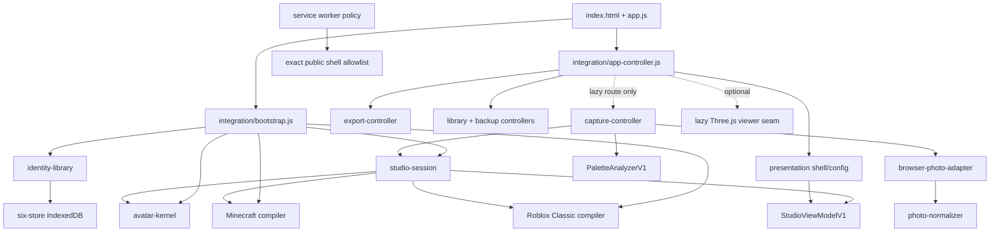

# My Avatars — Hard Dependency Code Map

This map helps Fable connect product requirements to the implementation without treating the current GUI as immutable. Links are relative to the repository root `/tmp/my-avatars-build`.

## Runtime dependency flow

Solid arrows are hard runtime dependencies. Dotted arrows are optional or lazy boundaries.

## Entry points and composition

| Responsibility | Code | Hard dependencies |
| --- | --- | --- |
| Static accessible DOM and stable selectors | [`index.html`](../index.html) | Presentation/controller IDs; no domain logic |
| Browser startup | [`app.js`](../app.js) | Bootstrap, app controller, validated presentation config |
| Dependency composition and fallbacks | [`src/integration/bootstrap.js`](../src/integration/bootstrap.js) | Kernel, both compilers, repository/backup, memory library, session, durable adapter |
| Route lifecycle and controller composition | [`src/integration/app-controller.js`](../src/integration/app-controller.js) | Router, presentation, export/library/backup controllers, optional viewer; capture is dynamically imported |

## Domain and state spine

| Module | Code | Contract role |
| --- | --- | --- |
| Closed value contracts | [`src/domain/contracts.js`](../src/domain/contracts.js) | Rejects unknown/private fields and validates identity, recipes, snapshots, proposals, artifacts, and profiles |
| Defaults | [`src/domain/defaults.js`](../src/domain/defaults.js) | Photo-free identity and recipe baseline |
| Canonical serialization | [`src/domain/canonical-json.js`](../src/domain/canonical-json.js) | Stable hashing, manifests, backups, and authority binding |
| Digests | [`src/domain/digest.js`](../src/domain/digest.js) | SHA-256 over canonical values and artifact bytes |
| Pure state transitions | [`src/avatar-kernel/kernel.js`](../src/avatar-kernel/kernel.js) | Revision-checked semantic operations; no DOM, storage, game formats, or network |
| Compiler projection | [`src/avatar-kernel/projection.js`](../src/avatar-kernel/projection.js) | Privacy-safe `AppearanceSnapshotV1` shared by platform compilers |
| Presentation/session facade | [`src/studio-session/studio-session.js`](../src/studio-session/studio-session.js) | Closed actions, dirty-state safety, proposal authority, compiler isolation, stale async guards |
| Privacy-safe view model | [`src/studio-session/view-model.js`](../src/studio-session/view-model.js) | Only UI-safe identity, recipe, proposal, metadata, validation, and transient artifact URLs |

Hard rule: presentation talks to `StudioSession`; it does not call the kernel, repository, analyzer, or compilers directly.

## Local identity library

| Responsibility | Code | Hard dependencies/invariants |
| --- | --- | --- |
| IndexedDB mechanics | [`src/identity-library/database.js`](../src/identity-library/database.js) | Exact stores and transaction results |
| One-person repository | [`src/identity-library/repository.js`](../src/identity-library/repository.js) | Contracts, defaults, canonical checks, six-store atomic writes |
| Runtime adapter | [`src/integration/durable-library.js`](../src/integration/durable-library.js) | Repository ↔ session translation; preserves unsaved working recipe state |
| Memory fallback | [`src/studio-session/memory-library.js`](../src/studio-session/memory-library.js) | Same session-facing behavior without persistence |
| Photo normalization | [`src/identity-library/photo-normalizer.js`](../src/identity-library/photo-normalizer.js) | Bounded dimensions, metadata-free encoding, staged commit/rollback, resource release |
| Photo-free backup | [`src/identity-library/backup.js`](../src/identity-library/backup.js) | Canonical sanitized export, matching import, pristine-only disaster restore |
| Backup UI | [`src/integration/backup-controller.js`](../src/integration/backup-controller.js) | Download URL lifecycle and separate destructive confirmations |
| Library UI | [`src/integration/library-controller.js`](../src/integration/library-controller.js) | Look/photo deletion and person-reset confirmations |

Hard rule: normalized photo blobs remain behind repository/capture ports. Only closed photo metadata reaches `StudioViewModelV1`.

## Optional capture and analysis

| Responsibility | Code | Boundary |
| --- | --- | --- |
| Route-only capture orchestration | [`src/integration/capture-controller.js`](../src/integration/capture-controller.js) | Dynamically imported only for `#/experimental/capture` |
| Browser decode/Canvas adapter | [`src/integration/browser-photo-adapter.js`](../src/integration/browser-photo-adapter.js) | Original bytes and decoded resources are transient; no network API |
| Deterministic bounded analysis | [`src/identity-analyzer/palette-analyzer-v1.js`](../src/identity-analyzer/palette-analyzer-v1.js) | Proposes palette operations only; never mutates storage or accepted identity |
| Proposal authority helper | [`src/experimental/capture-route.js`](../src/experimental/capture-route.js) | Binds proposal to evidence and base identity revision |

Hard rule: analysis creates a proposal. Only an explicit session acceptance action can change accepted identity state.

## Platform compilers

| Platform | Compiler | Layout/painter/package dependencies |
| --- | --- | --- |
| Minecraft | [`src/compilers/minecraft/compiler.js`](../src/compilers/minecraft/compiler.js) | [`layout-v1.js`](../src/compilers/minecraft/layout-v1.js), [`painter.js`](../src/compilers/minecraft/painter.js), [`png.js`](../src/compilers/minecraft/png.js) |
| Roblox Classic | [`src/compilers/roblox-classic/compiler.js`](../src/compilers/roblox-classic/compiler.js) | [`template-v1.js`](../src/compilers/roblox-classic/template-v1.js), [`painter.js`](../src/compilers/roblox-classic/painter.js), [`package.js`](../src/compilers/roblox-classic/package.js), shared strict PNG codec |

Both compilers depend only on a validated appearance snapshot and a platform profile. Neither compiler reads photos, IndexedDB, DOM state, or the other compiler's output.

## Presentation and replaceable GUI boundary

| Responsibility | Code | Stable contract |
| --- | --- | --- |
| View-model rendering | [`src/presentation/shell.js`](../src/presentation/shell.js) | Stable selectors and `StudioViewModelV1` |
| Validated presentation seam | [`src/presentation/config.js`](../src/presentation/config.js) | Closed theme/layout/label variants with immutable fallback |
| Source configuration | [`presentation-config.v1.json`](../presentation-config.v1.json) | GUI choices Mark or David may revisit |
| Block Adventure styles | [`styles.css`](../styles.css) | Tokens, responsive behavior, reduced motion, visible focus |
| Exact 2D + optional 3D viewer | [`viewer.js`](../viewer.js), [`src/pwa/optional-viewer.js`](../src/pwa/optional-viewer.js) | 3D failure cannot block 2D preview or export |

Fable may propose a different layout or interaction choreography, but changes must preserve the view-model fields, action semantics, privacy states, validation states, accessibility behavior, and browser-test selectors.

## Offline and deployment boundary

| Responsibility | Code | Invariant |
| --- | --- | --- |
| App-shell policy | [`src/pwa/app-shell.js`](../src/pwa/app-shell.js) | Exact `/my-avatars/` public paths and versioned cache |
| Service worker | [`sw.js`](../sw.js) | Cache-only shell behavior; no IndexedDB/photo access |
| Update lifecycle | [`src/pwa/register-service-worker.js`](../src/pwa/register-service-worker.js) | User-controlled activation gated by session safety |
| Pages allowlist | [`deploy/pages-allowlist.txt`](../deploy/pages-allowlist.txt) | Only explicitly public checked-in paths |
| Committed-blob staging | [`deploy/stage-pages.sh`](../deploy/stage-pages.sh) | Stages committed allowlisted blobs, never repository root |
| Manual deployment workflow | [`.github/workflows/deploy-pages.yml`](../.github/workflows/deploy-pages.yml) | No automatic deployment from this local work |

## Requirement-to-test links

| Requirement family | Primary evidence |
| --- | --- |
| Kernel revisions, contracts, and privacy-safe snapshot | [`tests/unit/avatar-kernel.test.js`](../tests/unit/avatar-kernel.test.js), [`tests/unit/contracts.test.js`](../tests/unit/contracts.test.js), [`tests/unit/snapshot.test.js`](../tests/unit/snapshot.test.js) |
| Minecraft parity and preflight | [`tests/unit/minecraft-compiler.test.js`](../tests/unit/minecraft-compiler.test.js), [`tests/unit/minecraft-validator.test.js`](../tests/unit/minecraft-validator.test.js) |
| Roblox package, previews, provenance, and preflight | [`tests/unit/roblox-compiler.test.js`](../tests/unit/roblox-compiler.test.js) |
| IndexedDB, deletion, backup, and recovery | [`tests/integration/identity-library.test.js`](../tests/integration/identity-library.test.js), [`tests/integration/deletion.test.js`](../tests/integration/deletion.test.js), [`tests/integration/backup.test.js`](../tests/integration/backup.test.js) |
| Runtime composition, persistence, dirty-state safety, compiler isolation | [`tests/integration/runtime-integration.test.js`](../tests/integration/runtime-integration.test.js), [`tests/integration/studio-session.test.js`](../tests/integration/studio-session.test.js), [`tests/integration/compiler-isolation.test.js`](../tests/integration/compiler-isolation.test.js) |
| Capture, quota recovery, retained photos, and backup UI | [`tests/integration/spec-gap-recovery.test.js`](../tests/integration/spec-gap-recovery.test.js), [`tests/integration/backup-controller.test.js`](../tests/integration/backup-controller.test.js) |
| PWA and deployment safety | [`tests/unit/service-worker-policy.test.js`](../tests/unit/service-worker-policy.test.js) |
| Manual/live browser evidence | [`tests/browser/scenarios.md`](../tests/browser/scenarios.md) |

## Code-map provenance

The codebase graph successfully indexed the committed/stable core and confirmed the `StudioSession` dependency shape. The graph service failed while expanding to the uncommitted integration tree, so integration edges above were verified from current ES-module imports and focused tests. Fable should treat this file as the current human-readable dependency map and rerun repository indexing after the integration commit if it needs a generated graph artifact.
